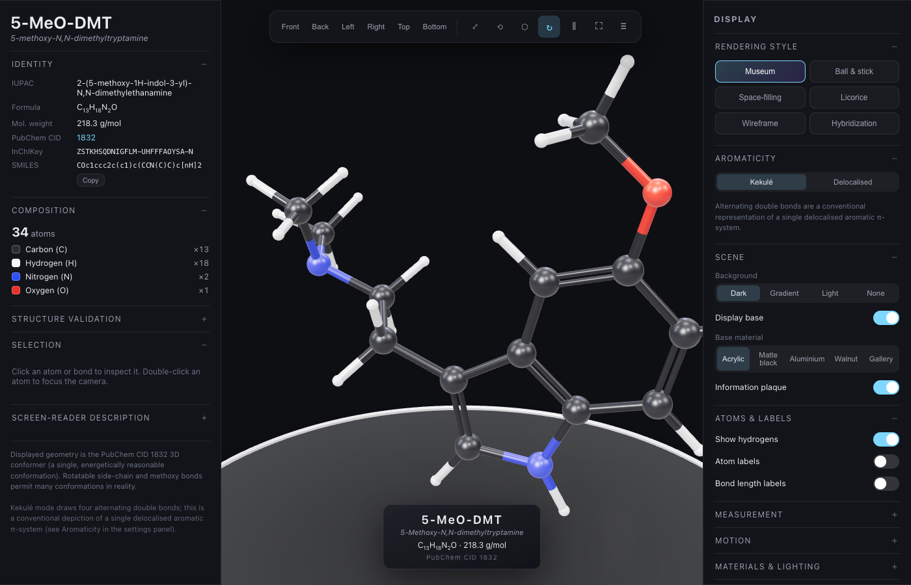

# 5-MeO-DMT — Interactive Molecular Display

A museum-quality, scientifically accurate, fully interactive 3D model of
**5-MeO-DMT** (5-methoxy-*N*,*N*-dimethyltryptamine, C₁₃H₁₈N₂O, PubChem
CID 1832), rendered in real time with WebGL / Three.js and built as a modular
React + TypeScript + Vite application.

**▶ Live demo: https://michaelcoley.github.io/molecule-5meo-dmt/**

The geometry is the **authentic PubChem CID 1832 3D conformer** — atomic
coordinates, elements, connectivity, bond orders and hydrogens are preserved
exactly, never guessed from a 2D diagram. The structure is validated
programmatically before it is ever drawn.



---

## Quick start

```bash
npm install
npm run dev        # http://localhost:5173
```

Build and preview a production bundle:

```bash
npm run build      # type-checks, then emits an optimised bundle to dist/
npm run preview    # serve the production build locally
```

Run the test suite:

```bash
npm test           # vitest, one-shot
npm run test:watch # watch mode
npm run typecheck  # tsc --noEmit
```

Requires Node 18+ and a WebGL-capable browser. If WebGL is unavailable the app
degrades gracefully to a text data sheet.

---

## Features

**Interaction** — orbit / zoom / pan (mouse, trackpad, touch) with damped
`OrbitControls`; click an atom or bond to inspect it; double-click an atom to
center on it; reset, fit-to-view, six standard views (front/back/left/right/top/
bottom) with animated transitions; orthographic ⇄ perspective toggle;
auto-rotation with adjustable speed; pause; full-screen presentation.

**Rendering modes** — Museum (physically-based clearcoat materials, studio
reflections, contact shadows), Ball-and-stick, Space-filling (van der Waals),
Licorice, Wireframe, and an educational Hybridization mode that colours atoms by
sp²/sp³ character and the distinct geometries of the two nitrogens and the
oxygen.

**Chemistry** — accurate covalent/vdW-scaled radii; CPK colours plus a
high-contrast accessibility palette; double bonds drawn as **two parallel
cylinders** with a stable in-plane offset (never a single fat rod); selectable
**Kekulé** (alternating double bonds) and **delocalised** aromatic
representations, with a clear note that the alternating bonds are a conventional
depiction of one delocalised π-system.

**Scientific tools** — measurement mode (2 atoms → distance in Å, 3 → bond angle,
4 → dihedral, drawn in-scene); atom/bond/hybridization/number labels; bond-length
labels; a collapsible information panel with identity, elemental composition,
per-atom descriptors (element, atomic number, hybridization, geometry, formal
charge, coordinates) and per-bond descriptors (order, aromaticity, length).

**Presentation** — optional museum base in five materials (acrylic, matte black,
brushed aluminium, dark walnut, white gallery pedestal), a professional plaque,
and dark / gradient / light / transparent backgrounds. Three-point lighting
(key + fill + rim) plus hemispheric ambient, all live-adjustable.

**Export** — SVG **vector line art** (true camera re-projection with gradient
spheres and depth sorting — not a raster screenshot), transparent PNG,
high-resolution PNG at 2×/4×/8× (with a higher geometry-detail export pass),
GLB and glTF (true 3D), atom/bond JSON, the raw SDF, a printable information
sheet, and SMILES-to-clipboard.

**Accessibility** — keyboard shortcuts, ARIA roles/labels, visible focus rings,
`prefers-reduced-motion` and `prefers-contrast` support, a high-contrast palette,
a screen-reader text description of the structure, and responsive layout for
desktop, tablet and mobile.

### Keyboard shortcuts

| Key | Action | Key | Action |
| --- | --- | --- | --- |
| `F` | Fit to view | `1`–`6` | Front/Back/Left/Right/Top/Bottom |
| `R` | Reset camera | `H` | Toggle hydrogens |
| `Space` | Pause / resume | `L` | Toggle atom labels |
| `M` | Toggle measurement mode | | |

---

## Project structure

```
src/
  data/                     # Molecular data layer (framework-free, unit-tested)
    5meo-dmt.sdf            # Authentic PubChem CID 1832 3D conformer
    elements.ts            # CPK/accessible palettes, radii, atomic data
    sdfParser.ts           # MDL V2000 SDF parser
    hybridization.ts       # Ring detection, aromaticity, hybridization/geometry
    validator.ts           # Composition + structural-feature validation
    molecule.ts            # Assembled, annotated molecule model + metadata
  three/                    # Three.js rendering layer
    MoleculeViewer.ts      # Scene, cameras, controls, picking, camera framing
    atom + bond geometry   # Procedural spheres/cylinders (inside MoleculeViewer)
    lighting.ts            # Three-point rig + generated environment map
    museumBase.ts          # Pedestal + contact-shadow catcher
    measure.ts             # Pure distance/angle/dihedral maths (unit-tested)
    cameraMath.ts          # Pure fit-distance maths (unit-tested)
    webgl.ts               # WebGL capability detection
  export/
    svgExporter.ts         # Vector SVG projection exporter
    exporters.ts           # PNG / GLB / glTF / JSON / SDF / print / clipboard
  ui/                       # React components
    Toolbar, InfoPanel, SettingsPanel, Plaque, controls
  hooks/useLocalStorage.ts  # Persist user settings
  settings.ts               # Shared settings model + defaults
  App.tsx / main.tsx        # App shell
  tests/                    # Vitest suites
```

The molecular-data layer has **no dependency on Three.js or React**, so it is
fully unit-tested in isolation and the same routines drive both the rendered
annotations and the validation (they can never disagree).

---

## Scientific & rendering decisions

- **Authentic coordinates, validated before render.** The embedded SDF is parsed
  and checked for the exact composition (13 C, 18 H, 2 N, 1 O; 34 total) and for
  every defining structural feature — fused indole ring system, 5-methoxy group,
  the two-carbon ethylamine side chain, two terminal *N*-methyls, the indole
  N–H, and the **neutral** tertiary amine (no proton, as required for the free
  base). Ring detection and hybridization are computed from the graph, not
  hard-coded. A failed validation logs a loud developer error.

- **Hybridization is derived, not assumed.** Rings are found via a shortest-
  alternate-path search; a 5-/6-membered all-C/N ring with ≥2 formal double bonds
  is treated as aromatic. This yields the eight trigonal-planar sp² indole
  carbons, five sp³ carbons, the planar (pyrrole-type) indole nitrogen, the
  trigonal-pyramidal tertiary amine nitrogen, and the bent ether oxygen.

- **Honest double bonds.** Multiple bonds are two parallel cylinders offset along
  a perpendicular that is kept *in the local chemical plane* (using a
  neighbouring atom as reference), so they stay stable and correctly oriented as
  the camera moves — rather than a single thickened rod.

- **Aromaticity, both ways.** Kekulé mode draws the four alternating double bonds
  of the indole system; delocalised mode draws uniform aromatic connectors with a
  subtle partial-bond accent. The UI states plainly that the alternating bonds
  are a conventional representation of a single delocalised π-system.

- **Resolution-independent geometry.** Atoms and bonds are true procedural sphere
  and cylinder meshes re-rendered at the device pixel ratio (capped at 2× for
  performance), so the model stays sharp at any zoom. Sphere/cylinder segment
  counts adapt — interactive detail for 60 fps, higher detail for PNG export.

- **True vector export.** The SVG exporter re-projects the current camera view
  into 2D vector circles (with radial-gradient shading), split-coloured bond
  lines, optional labels, and painter's-algorithm depth sorting. It is genuine
  line art, not a raster screenshot embedded in an `<svg>`. For real 3D, use the
  GLB/glTF export (SVG is a 2D format by definition).

- **The molecule floats, unsupported.** The optional pedestal and soft contact
  shadow sit beneath the model; no fake chemical bonds anchor it to the base.

See [`DATA_SOURCES.md`](DATA_SOURCES.md) for full provenance and citations.

---

## Tests

`npm test` runs Vitest suites covering the SDF parser (counts, coordinates,
double-bond count, neutral charges), the validator (exact composition, every
structural feature, and rejection of a tampered structure), ring detection and
hybridization classification, the measurement maths (distance/angle/dihedral,
in-plane perpendicular), the assembled model (molecular weight ≈ 218.30 g/mol,
reasonable bond lengths, centering, camera-fit distance), and the SVG vector
exporter (one circle per atom, no raster payload, Kekulé-vs-delocalised bond
count, label toggling).

---

## Disclaimer

The displayed conformer is one energetically reasonable 3D conformation. The
rotatable side-chain and methoxy bonds allow many conformations in physical
reality. This project is an educational / decorative molecular visualization and
is not medical, pharmacological, or safety guidance.

## License

MIT
